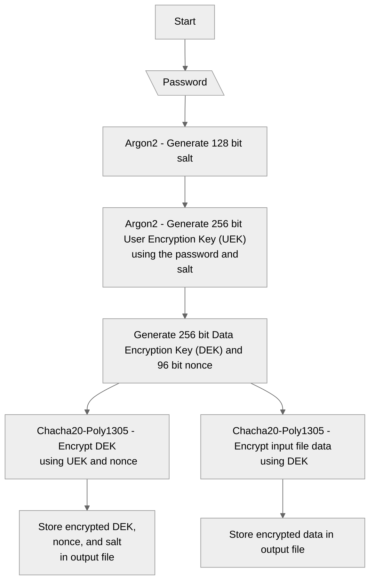

# secure-files-go

A file encryption/decryption program written in [Go](https://go.dev/). This is the Go version of the [same program](https://github.com/darshanags/secure-files) written in Zig.

This implements [RFC8439](https://datatracker.ietf.org/doc/html/rfc8439) which uses ChaCha20 as the cipher and Poly1305 for authentication, and [Argon2](https://datatracker.ietf.org/doc/html/rfc9106) for key derivation (KDF) from a given password.

**This is in no shape or form a well-polished program, so use at your own risk.**

## Usage
**Encrypt a file:**

    secure-files-go enc <input_file>
    
Encrypting a file will place the encrypted file in the same path as the _input_file_ with an extension of _.enc_.

**Decrypt a file:**

    secure-files-go dec <input_file>

## Compiled Binaries
Compiled binaries can be found in the [releases section](https://github.com/darshanags/secure-files-go/releases).
    
## Compiling Binaries
There are several ways to build binaries as outlines below. You will need Go configured in your system to build binaries.

 1. Clone the repository
 ````
git clone https://github.com/darshanags/secure-files-go.git
````
2. Build the Go project for your operating system by running the following from the root of the app directory:
````
go build -o out/bin/secure-files-go .
````
This will build a `secure-files-go` binary file in the `out/bin` folder.

**OR**

3. Run the makefile build command from the root of the app directory:
````
make build
````
This will build binary files specified in the make config file - *Makefile*.

## Program Flow
### Encryption


> Written with [StackEdit](https://stackedit.io/).
